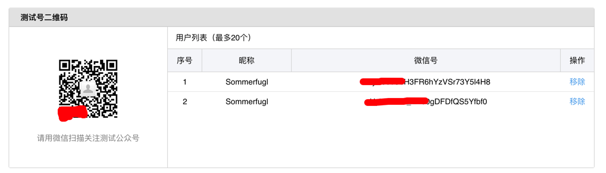
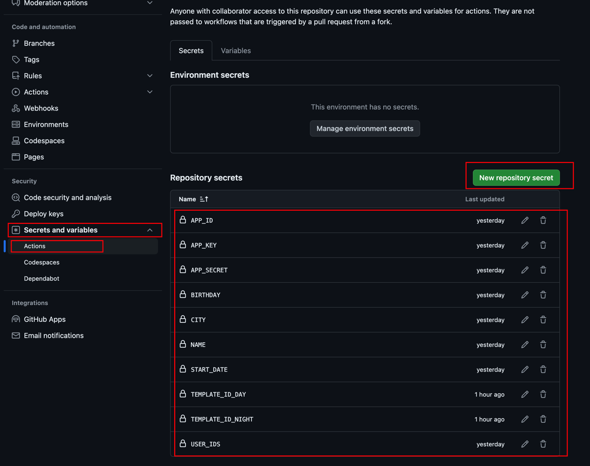
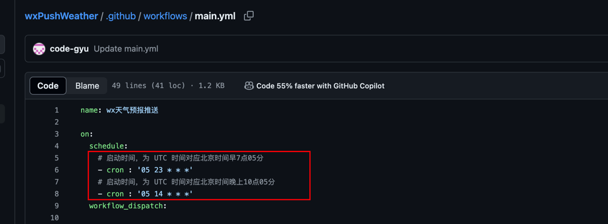

<div align="center">


<h1 align="center">


wxPushWeather


</h1>


[](https://github.com/code-gyu/wxPushWeather/stargazers)
[](https://github.com/code-gyu/wxPushWeather/network/members)
[](https://github.com/code-gyu/wxPushWeather/issues)
[](https://github.com/code-gyu/wxPushWeather/graphs/contributors)
[](https://github.com/code-gyu/wxPushWeather/blob/master/LICENSE)


</div>
<br>

**wxPushWeather 是一个用于微信测试号给订阅的用户推送微信消息的脚本【给女朋友专属的早晚浪漫，微信自动推送消息】，用python实现而成,代码极其简单，新手上手也特别容易。**

**原理：使用Github Action功能，运行python程序，实现无服务器的免费任务，比如天气推送，签到**

**如果这个项目很有意思，帮忙右上角点个 star✨ 支持我们 谢谢**

**如果有任何需要帮助欢迎联系545113081@qq.com**

作者 **CodeGyu** 全网同名，转载请注明作者

<h3 style="color: red;">重要通知：</h3>

**微信团队于2023-05-04日晚12点将不可再用【文字自定义颜色】**

---

详细功能如下：

- **支持多个收件人，验证是否收到更友好**
- **每天早上推送天气信息**
- **每天晚上推送次日天气信息**
- **各类文案集锦**
- **支持生日提醒**
- **设置值得纪念的日子**
- **自定义入参，模板定制更个性**
- **解决wx测试号上限20字的问题
- **使用github actions 不需要拥有服务器，白嫖actions执行，每天定时发送**

---


---
### 【操作流程】
### 申请公众号测试账户

使用微信扫码即可
https://mp.weixin.qq.com/debug/cgi-bin/sandbox?t=sandbox/login
进入页面以后我们来获取到这四个值 
#### appID  appSecret openId template_id

想让谁收消息，谁就用微信扫二维码，然后出现在用户列表，获取微信号（openId）

新增测试模板获得  template_id（模板ID）

模板标题随便填，模板内容如下，可以根据需求自己定制

模板内容-标题：宝贝，早上好啊☀️：
```copy
💓可爱的：{{name.DATA}} 
📅今天是：{{today.DATA}} 
🌍城市：{{city.DATA}} 
☁️今日天气：{{weather.DATA}} 
🌡️当前温度：{{now_temperature.DATA}} 
🌕今日最低温度：{{min_temperature.DATA}}
🌞今日最高温度：{{max_temperature.DATA}}  
❤️我们已经恋爱：{{love_date.DATA}}  
🎂距离你这个小笨蛋的生日还有：{{birthday.DATA}}  
🏮距离春节还有：{{diff_date1.DATA}}
🌄日出时间：{{sunrise.DATA}}
🌄日落时间：{{sunset.DATA}}
🌛夜间天气：{{textNight.DATA}}
☁️白天风向：{{windDirDay.DATA}}
☁️夜间风向：{{windDirNight.DATA}}
🐝风力等级：{{windScaleDay.DATA}}
💬{{note1.DATA}}{{note2.DATA}}{{note3.DATA}}{{note4.DATA}}{{note5.DATA}}
ʕ•̫͡•ʔ•̫͡•ཻʕ•̫͡•ʔ•͓͡•ʔʕ•̫͡•ʔ•̫͡•ཻʕ•̫͡•ʔ•͓͡•ʔʕ•̫͡•ʔ
```

模板内容-标题：宝贝，晚上好啊🌛：
```copy
💓可爱的：{{name.DATA}} 
📅今天是：{{today.DATA}} 
🌍城市：{{city.DATA}} 
☁️明日天气：{{weather.DATA}} 
🌡️当前温度：{{now_temperature.DATA}} 
🌕明日最低温度：{{min_temperature.DATA}}
🌞明日最高温度：{{max_temperature.DATA}}  
❤️我们已经恋爱：{{love_date.DATA}}  
🎂距离你这个小笨蛋的生日还有：{{birthday.DATA}}  
🏮距离春节还有：{{diff_date1.DATA}}
🌄日出时间：{{sunrise.DATA}}
🌄日落时间：{{sunset.DATA}}
🌛夜间天气：{{textNight.DATA}}
☁️白天风向：{{windDirDay.DATA}}
☁️夜间风向：{{windDirNight.DATA}}
🐝风力等级：{{windScaleDay.DATA}}
💬{{note1.DATA}}{{note2.DATA}}{{note3.DATA}}{{note4.DATA}}{{note5.DATA}}
ʕ•̫͡•ʔ•̫͡•ཻʕ•̫͡•ʔ•͓͡•ʔʕ•̫͡•ʔ•̫͡•ཻʕ•̫͡•ʔ•͓͡•ʔʕ•̫͡•ʔ
```
### 和风天气key申请(免费并且天气信息特准)
地址如下，不懂可以百度，特别简单，也可以给我邮箱
https://dev.qweather.com/docs/api/weather/weather-now/
### 项目配置 
Fork本项目
进入自己项目的Settings  ----> Secrets and variables ---> Actions --> New repository secret
配置好以下几个值（见下文示例）
```
START_DATE 哪天在一起的，格式：YYYY-MM-DD,示例："2021-03-14"
APP_KEY 和风天气key，需去和风天气申请
BIRTHDAY 生日,格式：MM-DD，示例："02-02"
APP_ID 微信公众号的appid
APP_SECRET 微信公众号app_secret
USER_IDS 微信公众号的user_id,多个用;（分号）隔开，示例："xxx;xxx"
TEMPLATE_ID_DAY 白天模板id
TEMPLATE_ID_NIGHT 晚上模板id
NAME 呢称，示例："牛牛"
CITY 城市,示例："上海"
```

进入自己项目的Action  ----> 天气预报推送 ---> weather_report.yml --> 修改cron表达式的执行时间
默认早上7点10分和晚上10点10分一次

